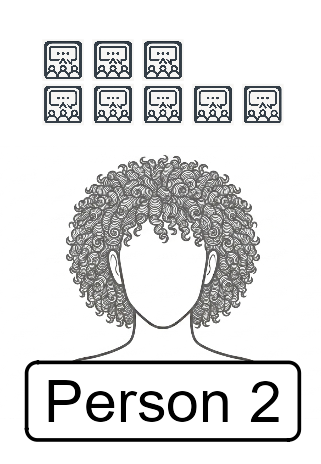
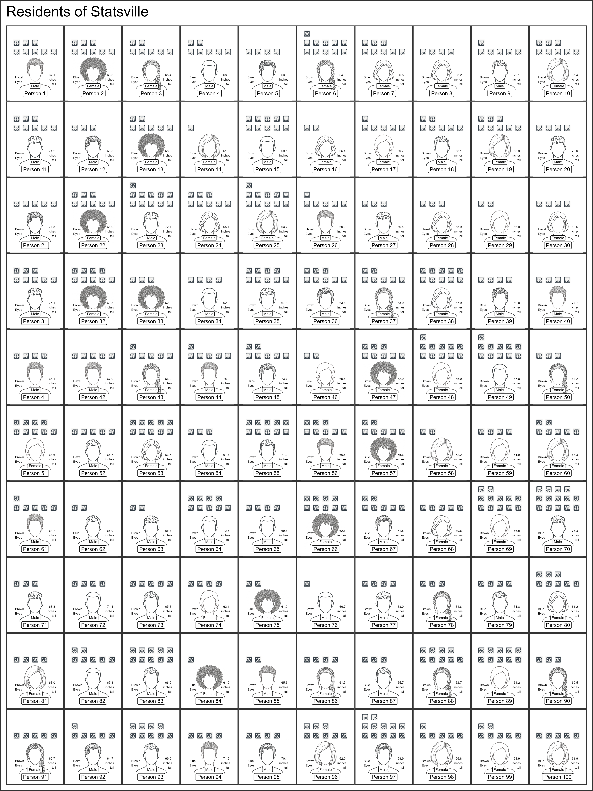
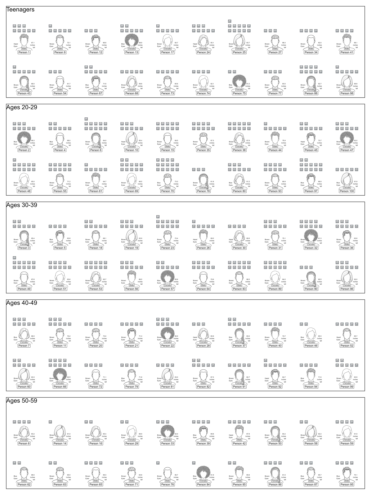

---
project:
  type: website

website: 
  title: "Sampling the town of Statsville"
  navbar:
    left:
      - href: statsville_census.qmd
        text: "Sampling Statsville"
        
format:
  html:
    page-layout: full
    toc: true
    toc-location: left
    toc-title: "Sampling Statsville"
    theme: cerulean
---

## Introduction

*Statsville* is a quaint fictional hamlet that is nestled in the foothills of the *Regression Mountains* with a beautiful view of *Lake Median*. The **population** is quite small as only **100 residents** between the ages of 13 and 59 live in Statsville. The layout of the town is a basic square grid with 20 unique roads – *conveniently* named with first letters A to T. 

The *Mean Diner* is looking to increase business and has decided to start advertising on social media. Before investing into their campaign, management wishes to know what sort of effort is required to advertise on social media. In particular, management needs to know how many social media apps each resident typically uses so they can spend their advertising dollars wisely.

::: {style="float: right; margin-left: 15px;"}
{width="100px"}
:::
A diagram below displays all 100 residents along with an icon {height=13pt} for each social media site (*e.g.*, TikTok, YouTube, Instagram) the resident uses regularly. For example, Person 2 regularly uses 8 social media sites as {height=13pt} appears 8 times. Another includes an image of those same residents stratified by their respective age groups (teenagers, twenty-somethings, residents in their 30s, in their forties and fifties). Lastly, a final figure includes an image of each resident grouped by the street in which they live.

We will use this population to explore different sampling techniques to help the *Mean Diner* estimate the average number of social media accounts for residents in *Statsville*. 

### Teacher Notes & Citations

This activity was heavily influenced by the Random Rectangles activity (Scheaffer, et al., 1996). All images were generated using the Gemini Large Language Model (Google, 2026). 

> Google. (2026). Gemini 3.6 Flash [Large language model]. https://gemini.google.com/app

> Scheaffer, R.L., Watkins, A., Gnanadesikan, M., Witmer, J.A. (1996). Random Rectangles. In: Activity-Based Statistics. Textbooks in mathematical sciences. Springer, New York, NY. https://doi.org/10.1007/978-1-4757-3843-8_21

## Full Population

{.lightbox}

## Grouped by Ages

{.lightbox}

## Population grouped by Streets

{.lightbox}
